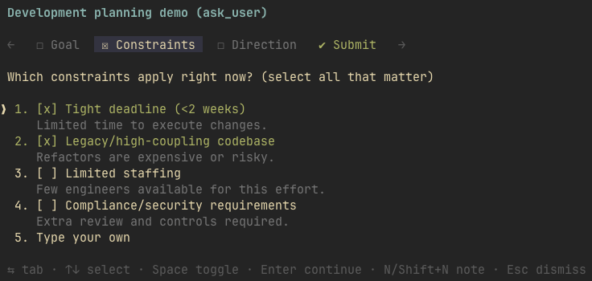
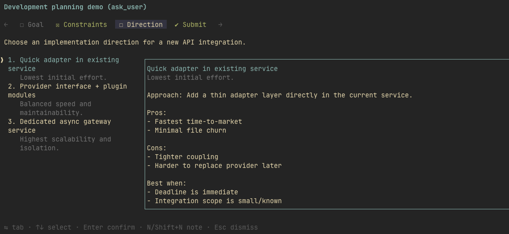
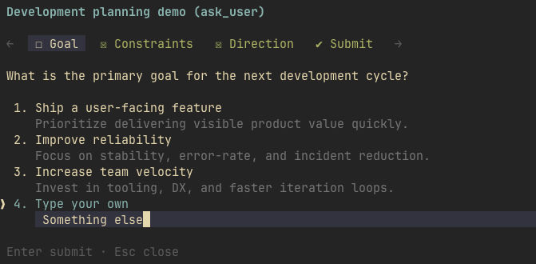
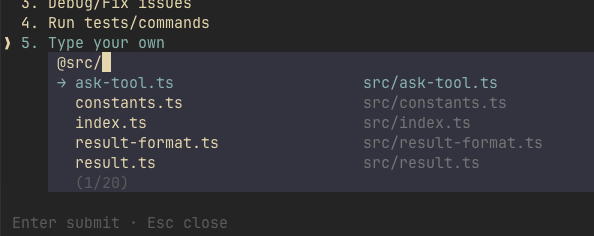
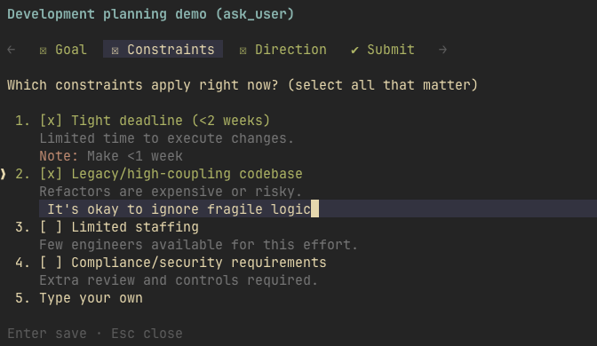

# @eko24ive/pi-ask

`@eko24ive/pi-ask` is an ask tool that cares about your answers.

It lets an agent pause, ask structured questions in a terminal UI, and continue with normalized answers instead of guessing.

https://github.com/user-attachments/assets/a8503ca9-afcb-4c31-9edc-353b985a0209


## Install

```bash
pi install npm:@eko24ive/pi-ask
```

You can also install from git:

```bash
pi install git:github.com/eko24ive/pi-ask
```

Or try it without installing (load once for the current run):

```bash
pi -e npm:@eko24ive/pi-ask
```

## Features

Once installed, this package gives the agent a native way to ask for clarification instead of guessing.

- 🧭 Familiar ask-style interface: tabbed questions, single/multi select, and preview mode
- ✍️ Inline free-form `Type your own` answers
- 📎 Native pi-style `@` file references inside answer and note editors
- 📝 Question-level and option-level notes
- 👀 Review tab with `Submit`, `Elaborate`, and `Cancel`
- 💬 Elaboration flow to capture note-based clarification before final submission
- ⌨️ Fast keyboard-first interaction (also mobile-friendly in remote sessions)

## Feature walkthrough

### Multi-question flow (tabs)
Move across several related questions in one ask flow.


### Single-select question
Pick one option when answers are mutually exclusive.


### Multi-select question
Choose multiple options when several answers apply.



### Preview mode
Use a dedicated preview pane when options need richer detail.



### Custom answer (`Type your own`)
Capture free-form input inline without leaving the flow.



### Native `@` file references
Use pi-style `@` file path autocomplete inside free-form answers and note editors.



### Option notes
Attach clarification notes to a specific option (`n`).



### Question notes
Add notes at question level for broader context (`Shift+N`).


### Review tab — Submit
Review all answers before returning them to the agent.


### Review tab — Elaborate
Ask the agent to elaborate on notes before finalizing choices.


## Key bindings

| Key                         | Context                                 | Effect                                      |
|-----------------------------|-----------------------------------------|---------------------------------------------|
| `?`                         | Ask flow / empty editor                 | Open key bindings modal                     |
| `Tab` `Shift+Tab`           | Main flow                               | Switch tabs                                 |
| `←` `→`                     | Main flow                               | Switch tabs                                 |
| `↑` `↓`                     | Main flow                               | Move cursor                                 |
| `1..9`                      | Options list                            | Select or toggle matching option            |
| `Space`                     | Single- or multi-select option          | Toggle selection                            |
| `Enter`                     | Single-select option                    | Confirm and continue                        |
| `Enter`                     | Multi-select option                     | Continue                                    |
| `n`                         | Active option                           | Edit option note                            |
| `Shift+N`                   | Current question                        | Edit question note                          |
| `1` `2` `3`                 | Review tab                              | Trigger `Submit` / `Elaborate` / `Cancel`   |
| `↑` `↓`                     | Review tab                              | Change highlighted review action            |
| `Enter`                     | Review tab                              | Confirm highlighted review action           |
| `Enter`                     | Free-form answer editor                 | Save and submit current input               |
| `Enter`                     | Note editor                             | Save current note                           |
| `Esc`                       | Free-form or note editor                | Save draft and close editor                 |
| `Ctrl+C`                    | Anywhere                                | Dismiss entire ask flow immediately         |
| `↑` `↓`                     | Empty editor                            | Move options without closing editor         |
| `Tab` `Shift+Tab` / `←` `→` | Empty editor                            | Switch tabs without closing editor          |
| Arrow keys / `Tab`          | Non-empty editor                        | Stay in editor for cursor movement          |

## Use

After installation, the extension registers the `ask_user` tool.

Agents can auto-discover and call it when they need clarification instead of guessing. In interactive sessions, it opens a terminal UI flow for structured answers, supports native pi-style `@` file references while typing answers or notes, and returns normalized answers back to the agent.

This package also bundles the `ask-user` skill profile from `skills/ask-user/SKILL.md`. It reinforces when to use the tool, is enabled by default when installed, and can be disabled via `pi config`. The skill was inspired by https://github.com/edlsh/pi-ask-user.

You can still add your own agent instruction if you want to further reinforce usage.

For exact input/output and UX guarantees, see [`docs/contract.md`](docs/contract.md).

## Local development

### Run locally in pi

```bash
pi -e ./src/index.ts
```

### Run in isolated test mode (extension + bundled skill only)

```bash
pnpm dev
pnpm dev ../test
```

`pnpm dev [path]` runs pi with `--no-extensions --no-skills --no-prompt-templates --no-themes --no-context-files`, loads this repo’s extension and `skills/ask-user`, and starts pi from `[path]` by changing directories before launch (defaults to `.`).

### Install dependencies

```bash
pnpm install
```

### Install git hooks (contributors)

`lefthook` is not installed automatically. If you want the local commit hooks used by this repo, run:

```bash
pnpm exec lefthook install
```

### Development commands

```bash
pnpm format
pnpm lint
pnpm check
pnpm typecheck
pnpm test
```

### Commit workflow

This repo uses `lefthook`, Commitizen, conventional commitlint, and semantic-release.

If you want local hooks, install them once after `pnpm install`:

```bash
pnpm exec lefthook install
```

Recommended flow:

```bash
pnpm commit
```

## Project layout

- `src/` — TypeScript extension implementation
- `tests/` — behavior-focused tests
- `docs/` — small docs set for contract and architecture
- `docs/media/` — repository-only README media assets

## Documentation

Docs stay intentionally small:

- `docs/README.md` — index
- `docs/contract.md` — external behavior
- `docs/architecture.md` — module boundaries and invariants
